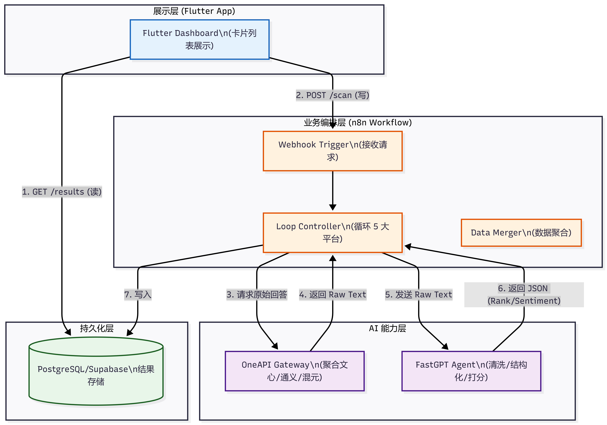

 # 📘 第一部分：系统架构文档 (Architecture Design)

   这是一个**事件驱动 (Event-Driven)** 的架构。n8n 作为中枢神经，调度一切。

   Code snippet

   ```
   graph TD
       %% 定义样式
       classDef client fill:#e3f2fd,stroke:#1565c0,stroke-width:2px;
       classDef lowcode fill:#fff3e0,stroke:#e65100,stroke-width:2px;
       classDef ai fill:#f3e5f5,stroke:#4a148c,stroke-width:2px;
       classDef db fill:#e8f5e9,stroke:#1b5e20,stroke-width:2px;
   
       %% 1. 前端层
       subgraph Client_Side [展示层 (Flutter App)]
           FlutterUI[Flutter Dashboard\n(卡片列表展示)]:::client
       end
   
       %% 2. 编排层 (替代传统 Python 后端)
       subgraph Orchestration [业务编排层 (n8n Workflow)]
           Webhook_In[Webhook Trigger\n(接收请求)]:::lowcode
           Loop_Controller[Loop Controller\n(循环 5 大平台)]:::lowcode
           Data_Merger[Data Merger\n(数据聚合)]:::lowcode
       end
   
       %% 3. 模型与处理层
       subgraph AI_Layer [AI 能力层]
           OneAPI[OneAPI Gateway\n(聚合文心/通义/混元)]:::ai
           FastGPT[FastGPT Agent\n(清洗/结构化/打分)]:::ai
       end
   
       %% 4. 数据层
       subgraph Data_Layer [持久化层]
           Postgres[(PostgreSQL/Supabase\n结果存储)]:::db
       end
   
       %% --- 连线 ---
       %% 读写分离逻辑
       FlutterUI -->|1. GET /results (读)| Postgres
       FlutterUI -->|2. POST /scan (写)| Webhook_In
   
       %% 抓取流程
       Webhook_In --> Loop_Controller
       Loop_Controller -->|3. 请求原始回答| OneAPI
       OneAPI -->|4. 返回 Raw Text| Loop_Controller
       
       %% 清洗流程
       Loop_Controller -->|5. 发送 Raw Text| FastGPT
       FastGPT -->|6. 返回 JSON (Rank/Sentiment)| Loop_Controller
       
       %% 存库
       Loop_Controller -->|7. 写入| Postgres
   ```

   

   ### 2. 组件职责说明
   
   1. **Flutter App:** 只做两件事——展示数据库里的数据（读），告诉 n8n “开始跑任务”（写）。
   2. **n8n (The Backend):**
      - **角色：** 这是一个“无服务器后端”。
      - **任务：** 接收指令 -> 遍历 5 个 AI -> 拿到脏数据 -> 扔给 FastGPT 洗 -> 存进数据库。
3. **OneAPI:** 它可以把百度、阿里、腾讯、字节、Kimi 的接口全部伪装成 OpenAI 的格式。n8n 只需要调一个接口。
   4. **FastGPT:** **核心大脑**。它不负责回答问题，只负责把 OneAPI 抓回来的废话变成 `{"rank": 1}` 这样的 JSON。

   > 1. **前端**：使用 **Flutter** 构建，一次开发即可支持移动端查看，满足随时随地监控的需求。
   > 2. **后端**：摒弃了传统的重型后端，采用 **n8n** 进行业务流程编排。这让我能在一小时内接入 OneAPI 聚合的 5 个大模型接口，并自带重试和任务调度机制。
   > 3. **数据处理**：引入 **FastGPT** 作为数据清洗层，利用 LLM 的语义理解能力，把非结构化的 AI 回答转化为标准的 JSON 数据，存入数据库。